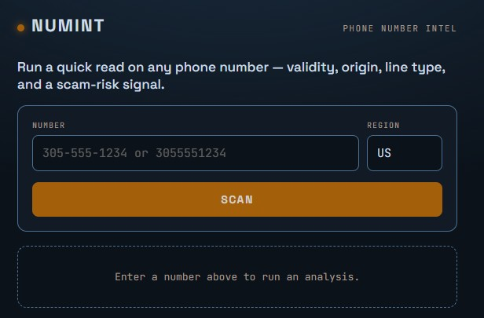

# NUMINT — Phone Number Intelligence

A lightweight OSINT tool for triaging suspicious phone numbers. Enter a number and get its
origin, line type, carrier, VOIP status, and a reputation-based scam signal — the kind of fast
check that helps spot vishing, smishing, and scam-callback numbers.



**Live demo:** https://allainborno.tech/numint

## Why

Scam and phishing operations lean on disposable VOIP numbers and previously-abused lines. A quick,
honest read on a number — where it's from, whether it's VOIP, and whether it carries a fraud
history — speeds up triage. NUMINT pulls only legitimate, public data and is deliberate about not
overstating what it knows.

## Features

- Number validation, formatting, and origin (country + US area-code city)
- Line type detection: mobile / landline / VOIP / toll-free
- Live carrier lookup and VOIP / burner detection
- Reputation-based fraud score (0-100) with recent-abuse and spammer flags
- Risk verdict - **LOW / ELEVATED / HIGH** - with an honest **UNKNOWN** when no live data is available
- Footprint search links for manual OSINT follow-up
- Forgiving input parsing (`3055551234`, `305-555-1234`, `+13055551234`, etc.)

## How it works

Two layers:

- **Offline engine** - `libphonenumber` parses and validates the number and resolves area-code
  origin with no external calls.
- **Live intelligence** - a Cloudflare Worker proxies the IPQualityScore API for carrier, VOIP,
  and fraud data.

The verdict is intentionally conservative. Without live reputation data, a normal-looking number
reads **UNKNOWN** rather than a false "safe." With live data, the fraud score and reputation flags
drive a real LOW / ELEVATED / HIGH.

## Security & design

- **API key is never exposed.** The IPQS key exists only as a Cloudflare Worker secret - never in
  the frontend or the repo. The browser calls the Worker; the Worker calls IPQS.
- **CORS-scoped.** The Worker only answers requests from the project's own domain.
- **Public data only.** No scraping of breached dumps or people-search PII brokers.
- **Honest signals.** The scam score is a heuristic that raises suspicion - it never claims proof.

## Stack

Vanilla JavaScript, `libphonenumber-js`, Cloudflare Workers, IPQualityScore API.
A Python CLI version uses the `phonenumbers` library.

## Files

| File | Purpose |
|------|---------|
| `numint.html` | Web app - static, hostable anywhere |
| `numint-worker.js` | Cloudflare Worker - set `IPQS_KEY` as a secret, paste the Worker URL into `numint.html` |
| `phone_osint.py` | Command-line version |
| `requirements.txt` | Python dependency for the CLI |
| `numint.jpg` | Screenshot used above |

## Setup (CLI)

```bash
pip install -r requirements.txt
python3 phone_osint.py "3055551234" --region US
```

## Roadmap

- Rate limiting on the Worker (per-IP throttle) to prevent abuse of the public endpoint and protect API credits
- Batch lookups for checking a list of numbers
- Additional reputation sources

## Responsible use

Built for triage and research on numbers you have a legitimate reason to check. Reputation data is
probabilistic - treat the score as a lead, not a verdict.
